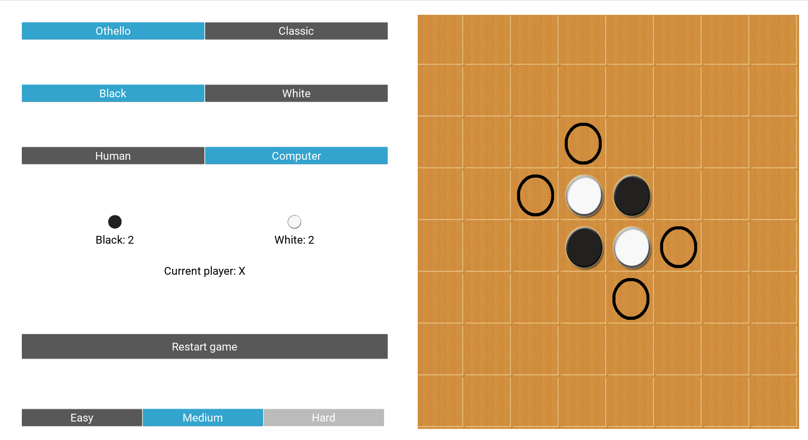

# Playing Reversi (Othello) With An AI Opponent
#### By Jonathan L. Moran (jo6155mo-s@student.lu.se)
From the EDAF70 - Applied Artificial Intelligence course given at Lunds Tekniska Högskola (LTH) | Vt1 2019.

## File Descriptions

Filename           | Description
-------------------|---------------------------------------------------------------------------------------
`environment.py`   | GUI implementation with Kivy.             
`game.py`          | Reversi/Othello game functions (turn taking, score reporting, move validation, etc).
`search.py`        | AI algorithms (Minimax with alpha-beta pruning).
`heuristics.py`    | Heuristic evaluation and utility function implementation.
`tests.py`         | Unit tests for hueristic and utility functions.


## Gameplay
### Introduction
[Reversi](https://en.wikipedia.org/wiki/Reversi) is a game played on an 8x8 board between two players– "Black" and "White". The objective of the game is to maximise the number of pieces ("discs") on the board belonging to a given player. Consequently, each player must make moves that attempt to minimise the number of their opponent's discs on the board. Each turn consists of making a single move that flanks (_reverses_) _one or more_ of their opponent's discs. If no such move exists, the player forfeits their turn. To flank disc(s), a player must surround a row, column or diagonal of opponent discs with two discs of their own colour. For example, the following configuration


allows White to place their next disc in an open position that surrounds the three adjacent Black discs.


The resulting move, shown above, flanks the three Black discs into White.


When the board is filled, or no other valid moves are available for either player, the game ends. The player with the most discs on the board wins.

**Fun fact**: A 1978 computerised version of Othello titled [Computer Othello](https://nintendo.fandom.com/wiki/Computer_Othello) was the first ever video game both developed and published by Nintendo.


### Reversi vs. Othello
Two popular variations of the game exist: Reversi ("classic") and Othello. While the gameplay and objective remain the same with either version, Othello places two additional restrictions at the start of the game. The first important distinction is that Othello fixes Black as the starting player. In Reversi, the players have the freedom to choose who makes the first move (which is usually decided with a coin toss). The other distinction is that Othello begins the game with the centre four squares already occupied in an diagonal pattern (alternating colours on the top and bottom rows). Reversi lets players place their starting discs in any configuration within the centre four squares.


### Starting a game
Once the dependencies are installed, run `python environment.py` inside the project directory to start the GUI.

If you recieve into an error, make sure that `kivy` framework is installed (`pip install kivy`).

When you've successfully started the game (after selecting rule set, player side, opponent type/difficulty), you should see the following:

. 

If so – congrats! You're all set to play 🎉


## AI Opponent Strategy
This program supports three "computer" difficulty modes (AI strategies):
   1. **Easy**: random choice;
   2. **Medium**: best move calculation using Minimax adversarial search with alpha-beta pruning;
   3. **Hard**: best move calculation (same as _Medium_ strategy) with heuristic evaluation.

### Random choice
When **Easy** is selected, the AI opponent is configured with a very basic random move evaluator.
*  Any valid move is chosen at random from the list of moves returned by `get_valid_moves()`.

### Best move (without heuristics)
When **Medium** is selected, the AI opponent chooses the "best" available move returned by `get_best_move()`.

The Minimax adversarial search algorithm recursively examines all possible board configurations (_states_) in a game tree. Each state in the tree is connected and reachable by executing a move. The `minimax_with_pruning()_` algorithm finds the next most optimal move in the game by looking a fixed number of moves ahead in the game tree.

*  `minimax_with_pruning()` recursively examines all possible game states following a move of the opponent (`depth` is the number of move iterations);
*  Calculates the best move by _minimising_ the opponent's immediate gain (number of discs flipped on next move).

Alpha-beta pruning is an optimisation applied to the Minimax algorithm which allows us to discard (_prune_) particular moves in the game tree that are said with certainty to be suboptimal. This grants us the ability to look more moves ahead in the game without compromising runtime [2].
*  `alpha`: best already-explored move along path to the root for the player (the _maximiser_).
*  `beta`: best already-explored move along path to the root for the opponent (the _minimiser_).
The recursive algorithm gracefully exits when a legal move satisfying `alpha >= beta` has been found.

### Best move (with heuristics)

#### Heuristic function
Each heuristic is scaled with a return value between -100 and +100. The total utility is calculated as a weighted sum of the heuristic evaluation functions. Each heuristic is explained in detail below.

```
if (no moves left in game)
         Utility Value =
         0.7 * Corner Captivity Heuristic Value + 0.2 * Mobility Heuristic Value + 0.1 * Coin Parity Heuristic Value

```

1. Corner Captivity
There are four corners on the game board. Once captured, they cannot be flanked by the opponent. Additionally, the player can build discs around the corner pieces to provide stability to their corner discs. Each of the four corners on the board are given equal weight (+25 pts per occupied square), and their three possible adjacent squares are given negative weight (-8 pts per occupied "C square" [3] _iff_ player is not in corner).
```
for corner in corners
         if (corner is occupied by player)
                  Corner Captivity Heuristic Value += 25
         elif (adjacent square is occupied by player)
                  Corner Captivity Heuristic Value -= 8
         return value if player is Max Player else -value
```

2. Mobility
This heuristic measures the difference in available moves between players. The idea behind the mobility heuristic is to restrict or minimise the opponent's possible moves while maximising the number of available moves to the player. The heuristic returned below is referred to as _immediate mobility_, i.e., the number of currently available (legal) moves to the player. _Potential mobility_ calculates the number of empty spaces next to at least one of the opponent's disc, implying a move to the player that opens up more possible moves in the future. We will only be considering immediate mobility in this case.
```
if ( Max Player Moves + Min Player Moves ) != 0
         Mobility Heuristic Value =
                  100 * ( Max Player Moves - Min Player Moves ) / (Max Player Moves + Min Player Moves)
else
         Mobility Heuristic Value = 0
```

3. Coin Parity
Also known as "counting discs," this heuristic measures the difference in discs between players. A naïve strategy using coin parity attempts to maximise the number of discs of the player at any point in the game. This strategy is ineffective since a single move can flank (flip) up to 18 discs, thus swinging the game in favor of either player at any point in time [2]. This strategy is naïve because neither the instability of discs nor the game dynamics are taken into consideration with the coin parity heuristic. Thus, a much smaller weight value will be applied to the calculation below.
```
Coin Parity Heuristic Value =
         100 * (Max Player Discs - Min Player Discs ) / (Max Player Discs + Min Player Discs)
```


## Future Implementations
- [x] Support for classic Reversi rule set
- [x] Improve GUI design and functionality
- [x] Refactor codebase (AIMA `Game` class)
- [x] Heuristic-based evaluation
- [ ] Show status bar while AI makes move
- [ ] Improve performance (e.g., iterative deepening, transposition table, move ordering)
- [ ] Implement Monte Carlo Tree Search (MCTS)

## Credits
This assignment was prepared by J. Malec et al., VT1 2019 (link [here](https://web.archive.org/web/20190514105836/http://cs.lth.se/edaf70/programming-assignments-2019/search/)).

*  Stuart, R. and Norvig, P. (2010). Artificial Intelligence: A Modern Approach. 3rd ed. Englewood Cliffs: Prentice-Hall, pp.167-174. (what's covered: alpha-beta evaluation fn, cutoff-test).

*  Norvig, P. (1991). Paradigms of Artificial Intelligence Programming, 1/e. Morgan Kaufmann. ISBN-10: 1558601910 or ISBN-13: 978-1558601918. (what's covered: Ch. 18 - Search and the Game of Othello).

Resources:
*  [1] Github - Rahul Arya (https://github.com/rahularya50/reversi)
*  [2] https://courses.cs.washington.edu/courses/cse573/04au/Project/mini1/RUSSIA/Final_Paper.pdf
*  [3] https://stackoverflow.com/a/13322392

Helpful explanations:
*  [Algorithms Explained - minimax and alpha-beta pruning](https://www.youtube.com/watch?v=l-hh51ncgDI)
*  [Step by Step: Alpha Beta Pruning](https://www.youtube.com/watch?v=xBXHtz4Gbdo)
*  [Thomas Wolf: The Anatomy of a Game Program](http://home.datacomm.ch/t_wolf/tw/misc/reversi/html/index.html).
