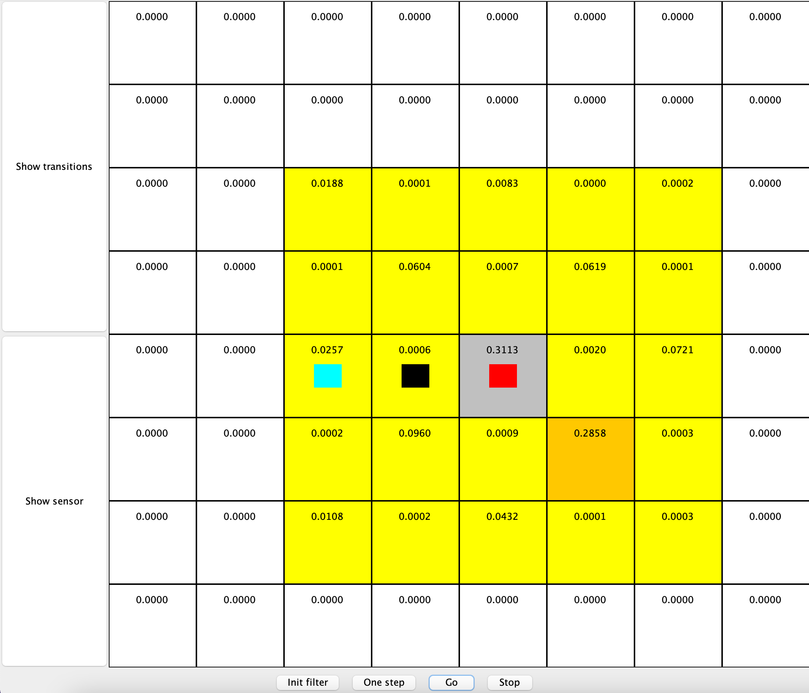
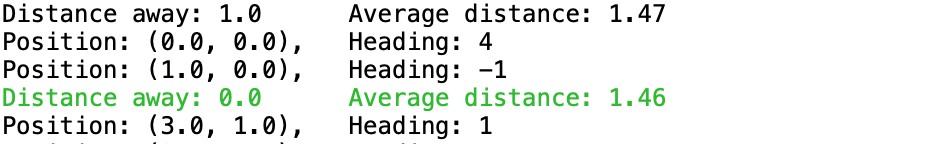
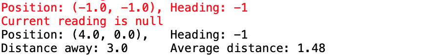

# Assignment 2: Probabilistic Reasoning Over Time (HMMs)
## Robot localisation with HMM-based forward filtering
#### By Jonathan L. Moran (jo6155mo-s@student.lu.se)
From the EDAF70 - Applied Artificial Intelligence course given at Lunds Tekniska Högskola (LTH) | Vt1 2019.

## File Descriptions

Filename                                | Description
----------------------------------------|----------------------------------------------------------------------------------------------------
`src/model/DummyLocalizer.java`         | Implements EstimatorInterface; provides basic definitions for recommended methods.             
`src/model/HMMLocalizer.java`           | Implements EstimatorInterface; handles the HMM and Robot functionality.
`src/model/Grid.java`                   | Discrete grid world environment handling Robot movement and location sensing.
`src/model/Sensor.java`                 | Reports the location of the robot according to a known probability of error.
`src/model/Position.java`               | Class for (x,y,h) state pairs; checks grid locations for neighbours and performs move validation.
`src/model/Pair.java`                   | State representation; Position instance coupled with a probability value.
`src/view/RobotLocalizationViewer.java` | Renders and updates the GUI using Java Swing and AWT.
`src/control/EstimatorInterface.java`   | Interface connecting the Localizer to the GUI.
`src/control/LocalizationDriver.java`   | Handles the thread-based execution of the RobotLocalizationViewer class.
`src/control/Main.java`                 | Initialises the Localizer and RobotLocalizationViewer, starts thread execution.
`src/model/PositionTest.java`           | Unit tests for the Position class.

## Robot Localisation
### Introduction
This task is based on Exercise 15.9 of the AIMA (2010) textbook – filtering in an environment with no landmarks. Consider an empty room represented by an `nxm` rectangular grid. The robot's location is hidden; the only evidence available to the observer is a noisy location sensor that gives an approximation to the robot's location. If the robot is at the true location `L = (x, y)` then with probability `0.1` the sensor gives the correct location, with probability `0.05` each it reports one of the 8 locations `Ls` immediately surrounding `(x, y)`, with probability `0.025` each it reports one of the 16 locations `Ls2` that surround those 8, and with the remaining probability of `1.0 - 0.1 - n_{Ls} * 0.05 - n_{Ls2} * 0.025` it reports "no reading." Note that the number of directly and indirectly surrounding fields, `n_{Ls}` and `n_{Ls2}` depend whether or not the robot at location `L` is in a corner, along a "wall" or at least 2 fields away from any "wall". This means that the sensor is more likely to produce "nothing" when the robot's true location is less than two steps from a wall or in a corner.

In addition to the sensor probability model given in Exercise 15.9, this assignment introduces a robot movement model. This governs the direction (heading) the robot will move from timestep `t` to `t+1`. A starting heading `h_0` is chosen at random. Then, for any new step a heading `h_{t+1}` is chosen based on the current heading `h_{t}` according to:

| Description                                       | Probability value |
|---------------------------------------------------|-------------------|
| P(h_{t+1} = h_{t})  \| not encountering a wall)   | 0.7               |
| P(h_{t+1} != h_{t}) \| not encountering a wall)   | 0.3               |
| P(h_{t+1} = h_{t})  \| encountering a wall)       | 0.0               |
| P(h_{t+1} != h_{t}) \| encountering a wall)       | 1.0               |

The robot will always move in the direction `h_{t+1}` by one step in the grid. In the case that a new heading is to be selected, one will be chosen at random from the possible valid headings (those that do not face a wall).

This task involves the implementation of a Hidden Markov Model with forward filtering to track the robot. One must first simulate the robot and its movement (and from there the sensor readings), then the HMM-based tracking algorithm evaluated against the ground truth of the simulated robot movement model. The algorithm essentially loops over the following three steps:
1.  Move the (simulated) robot to a new pose according to movement model.
2.  Obtain the (simulated) sensor reading based on the robot's actual position given the sensor model.
3.  Update the position estimate (vector `f`) using the forward-algorithm based on the sensor reading from Step 2, using the known sensor and transition models.

**Fun fact**: In addition to robot localisation, Hidden Markov Models (HMMs) like the one used in this exercise can also be useful for discrete state estimation. One might even find HMMs being used in today's neural/motor cortical prostheses (e.g., [Neuralink N1](https://www.youtube.com/watch?v=LgJpYOTll8U)) to assist in the decoding of goal-directed movement (more on that [here](https://web.stanford.edu/~shenoy/GroupPublications/KaoNuyujukianEtAlIEEETBME2017.pdf)).

### Implementation
This project was configured to run in Eclipse, a Java IDE. To build the project, you must have `JUnit` and `JRE` on your build path. 

The `RobotLocalizationViewer` provides a GUI interface to visualise the `(x, y, h)` state codings and state-transition probabilities. The position coordinates `x` and `y` are given in row, column units. The transition probabilities are displayed on the 2D grid as colour-coded squares. _Cyan_ indicates the location of the current sensor reading. _Black_ indicates the true position of the robot, _light grey_ indicates the highest probability estimate, _red_ indicates a high probability (p > 0.3), _orange_ indicates higher probabilities (0.1 < p <= 0.3), _yellow_ indicates low probability (0.0 < p <= 0.1) and _white_ indicates an "impossible" probability of p = 0.0. The actual state-transition probabilities are shown at the upper part of each field (truncated to four decimals). 

To start the program, first select the _Init filter_ button. This initialises the localiser with a uniform probability distribution and resets the viewer. To track the robot, the _One step_ or _Go_ buttons are used. As the name suggests, _One step_ allows you to move through one update cycle and visualise the result. This will perform the three steps mentioned above, then refresh the visualiser with the resulting probability values. In order to accurately track the robot, many 'update' steps will need to be performed. To start the continuous update loop, click the _Go_ button. The visualiser will refresh at each step until the _Stop_ button is pressed.

After a few cycles, you may notice the following:

Here you can see that the HMM-based localiser estimated a position "one-step off" (shown in _light grey_, _red_) from the true location of the robot (shown in _black_) based on a sensor reading at the location shown in _cyan_.

The console will also log the most-likely position estimate (e.g., the _light grey_/_red_ location shown above):

When the estimated location matches the true location of the robot, the console prints the message in green.

When the current sensor reading is `null` (due to probability of error/noise), the console prints the warning message in red.

Note that in both console logs, the "Heading" has a value `-1`. Given that the filtering algorithm only knows sensor readings, which only represent `(x, y)` positions in the grid, we can assume that the sensor reading is equally likely for the four states (headings) that correspond to one position on the grid. Thus, the location estimate is given a heading of `-1`. Furthermore, this allows us to "bundle" the four consecutive headings of each position along the observation matrix diagonal.

## Future Implementations
- [ ] Refactor Java codebase to Python
- [ ] Plot performance of HMM localiser (Fig. 15.8 in AIMA)
- [ ] Port `RobotLocalizationViewer` from Java to Python

## Credits
This assignment was prepared by E.A. Topp et al., VT1 2019 (link [here](https://web.archive.org/web/20191124213756/http://cs.lth.se/edaf70/programming-assignments-2019/probabilistic-reasoning/)).

Additional credits:
*  Stuart, R. and Norvig, P. (2010). Artificial Intelligence: A Modern Approach. 3rd ed. Englewood Cliffs: Prentice-Hall, pp.581-583, p.601. (what's covered: Exercise 15.9, HMMs, forward filtering)

Helpful explanations:
*  Bogunowicz, Damian. [Tutorial - Robot localization using Hidden Markov Models](https://dtransposed.github.io/blog/2018/04/01/Robot-Localization/).
*  Prorok, Amanda. [Lecture 5: Localization (video)](https://www.youtube.com/watch?v=-flpk-5Y_qc).